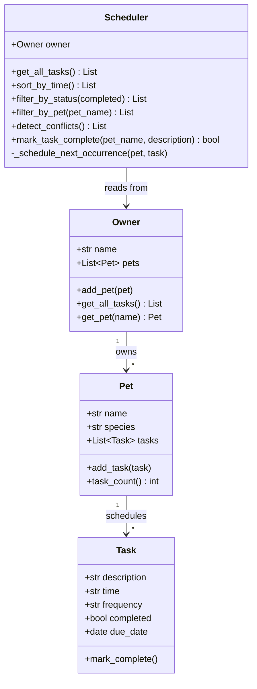

# PawPal+ — Final UML Class Diagram

## Relationships

- **Owner → Pet** (composition): An Owner manages one or more Pets. Pets don't exist independently of an Owner in this system.
- **Pet → Task** (composition): A Pet owns a list of Tasks. Tasks belong to the Pet they were added to.
- **Scheduler → Owner** (association): The Scheduler holds a reference to the Owner and queries it for pet/task data at runtime. This keeps the algorithmic layer separate from the data layer.
